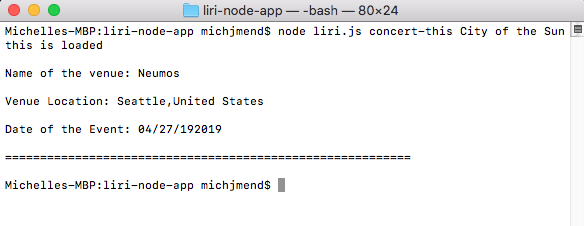
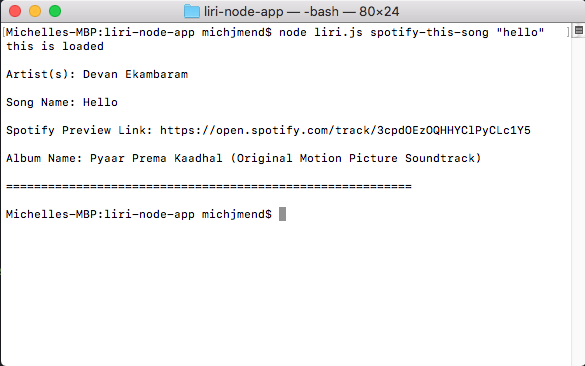
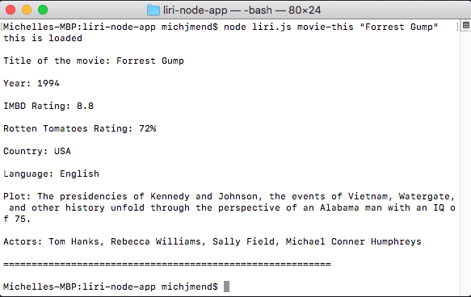
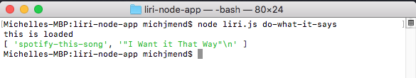

# liri-node-app
##Language Interpretation and Recognition Interface
**LIRI is similar to SIRI**

liri-node-app is a command line nodejs application that uses 3 different API's to output information about concerts, music on spotify, and movie info from OMDB.

Liri.js can take in the following commands:
1. node liri.js concert-this add-artist/band-name-here :musical_keyboard:

  

2. node liri.js spotify-this-song add-song-name-in-quotes :notes:

  

3. node liri.js movie-this add-movie-name-in-quotes :clapper:

  

4. node liri.js do-what-it-says :interrobang:
   1. Using the fs Node package, LIRI will take the text inside of random.txt and then use it to call one of LIRI's commands.
   2. It should run spotify-this-song for "I Want it That Way," as follows the text in random.txt.

  

By: Michelle Mendieta
